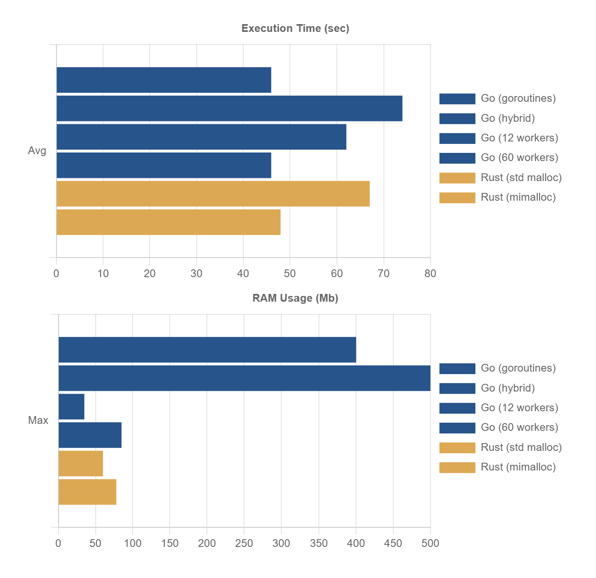
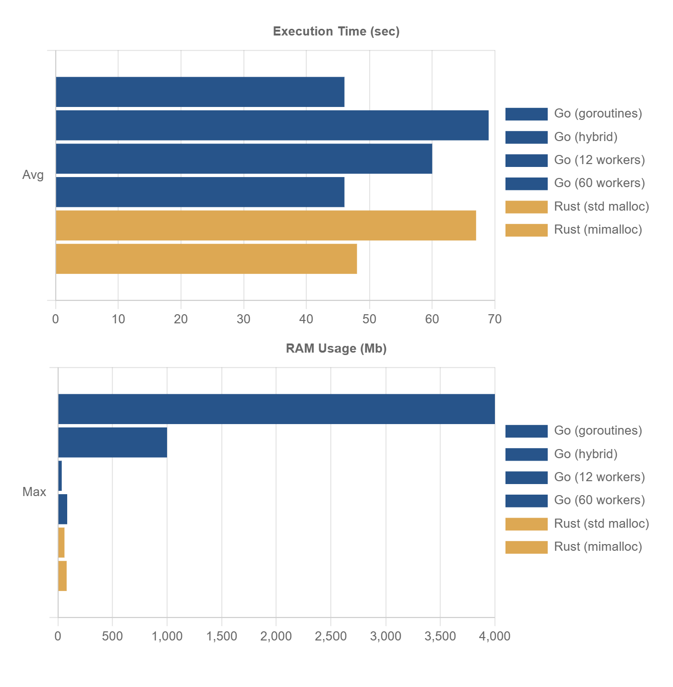

# Test description

In the test we run 100'000 tasks, in each task 10'000 small structs created, inserted into and retrieved from a hash-map.

No blocking I/O calls. I'm evaluating Go and Rust for writing high-performance multiplayer server. In the main game-loop all requests will be processed using game data in the RAM.

## First run

**NOTE:** The tests were executed on Windows/Intel CPU. A few people reported different results on MacOS with Apple M CPU, where Rust performed better, while not significantly. You can run the test yourself to verify the results.

Initially Rust showed 30% worse test execution time than Go. While the biggest difference was Go's massive RAM usage: 2-4Gb vs Rust's only 35-60Mb. But why? Is that simply because GC could't keep up with so many goroutines allocating memory?

I've noticed that on average Rust finished a task in 0.006s (max in 0.053s), while Go's average task duration was 16s! Big differrence! If both finished all tasks at roughtly the same time that could only mean that Go was executing thousands of tasks in parallel sharing limited amount of CPU threads. Rust was most likely running only couple of them at once, then started the next bunch, then the next one, etc. This explains why Rust's average task duration was so short and RAM usage so low.

## Rust optimizations

I've received a suggestion to use mimalloc instead of default memory allocator. With mimalloc Rust showed ~30% better execution time and minor RAM usage increase.

## Go optimizations

**1. Goroutines with CPU workers**

Since Go runs so many tasks in paralell it keeps thousands of hash maps filled with thousands of structs in the RAM. GC can't even free this memory because it is still is use. Rust on the other hand only creates couple of hash maps at once.

To solve this problem I've created a simple utility called "CPU workers". It will run a task/function in a goroutine, but it will not create more goroutines than CPU threads available.

Note that I'm still starting 100'000 goroutines - one per task. But instead of running the task inside each goroutine directly I call CPU worker from goroutine to execute my task function. That means I'm running 100'000 + 12 (CPU workers) gouroutines in total. This makes most goroutines to wait while limited number of CPU workers execute tasks and therefore they won't allocate thousands of hash maps at once.

With this optimization Go's memory usage dropped to 1000Mb at the beginning of the test and went down to 200Mb as test aproached the end. Which makes sence: more goroutines finished - more memory is released. This is at least 4 times better than before, but still far away from Rust.

**2. CPU workers only**

With the optimization #1 we are still creating 100'000 goroutines, most of which will wait 12 CPU workers (my CPU has 12 threads).

Let's use only CPU workers so we'll never create more goroutines than nessessary. 

With this change RAM usage dropped to 35Mb while execution time increased from 46s to 60s. I think this is a very reasonable price to pay. Note that we are still doing the same work: creating 100'000 goroutines, but not all at once.

**3. More CPU Workers**

I've also played with number of CPU Workers running in parallel. Limiting them to number of CPU threads (12 in my case) sounded reasonable. But running 60 workers gave solid 25% improvement. This change also increased RAM usage a bit - now it is similar to Rust with mimalloc: ~80Mb.

**4. Pool of CPU workers**

Instead of creating new gorotine every time, we can create a pool of goroutines and reuse them for multiple tasks. This can potentially remove overhead of creating and destroying 100'000 goroutines. While in reality this only gave a small performance gain. So goroutines are indeed low-overhead primitives.

## Instant burst vs continuous flow of requests

I've also realized that creating all 100'000 tasks at once in the beggining of the test is not what would happen in a multiplayer game server.

So I've simulated steady stream of request by creating 10 tasks each millisec (10'000 requests per sec). This decreased Go's RAM usage from 4Gb to 400-500Mb right away. If we create 10 tasks each 3 millisec (~3000 requests per sec), RAM usage drops to 120Mb even without any optimizations above.

## Final thoughts

The test showed that Go's goroutines need an extra care when CPU load approaches 100% utilization. Whereas Rust's "tokio" runtime handles it gracefully out of the box. Still, the optimization required for Go was very simple. Note that most of the optimizations I described above were just experiments that didn't give significant results. In fact you only need CPU workers (optimization #3).

## How to run the test

**Go:**

Edit main.go to enable/disable different test types.

```
cd go
go run -ldflags="-s -w" .
```

**Rust:**

```
cd rust
cargo run --release
```

# Test Results

Platform: Windows 10, Intel Core i7 CPU

## Start 10 new tasks each millisec

This test simulates 10'000 requests per sec until 100'000 tasks started. Then waits all to finish.

**Go:**

| Test                        | Total Time | Task Avg | RAM Usage |
|-----------------------------|------------|----------|-----------|
| Unrestricted goroutines     | 46.82s     | 160ms    | 400Mb     |
| Goroutines + 12 CPU workers | 74.92s     | 9ms      | 500Mb     |
| 12 CPU workers              | 62.18s     | 7ms      | 35Mb      |
| 60 CPU workers              | 46.93s     | 8ms      | 85Mb      |


**Rust (tokio tasks):**

| Test             | Total Time | Task Avg | RAM Usage |
|------------------|------------|----------|-----------|
| With std malloc  | 66.40s     | 6ms      | 60Mb      |
| With mimalloc    | 47.74s     | 4ms      | 78Mb      |

 

## Instant burst

This test starts 100'000 tasks as quick as possible. Then waits all to finish.

**Go:**

| Test                        | Total Time | Task Avg | RAM Usage   |
|-----------------------------|------------|----------|-------------|
| Unrestricted goroutines     | 46.61s     | 16770ms  | 2000-4000Mb |
| Goroutines + 12 CPU workers | 69.23s     | 8ms      | 200-1000Mb  |
| 12 CPU workers              | 60.73s     | 7ms      | 35Mb        |
| 60 CPU workers              | 46.69s     | 9ms      | 85Mb        |

**Rust (tokio tasks):**

| Test             | Total Time | Task Avg | RAM Usage |
|------------------|------------|----------|-----------|
| With std malloc  | 67.67s     | 6ms      | 60Mb      |
| With mimalloc    | 48.65s     | 4ms      | 78Mb      |




