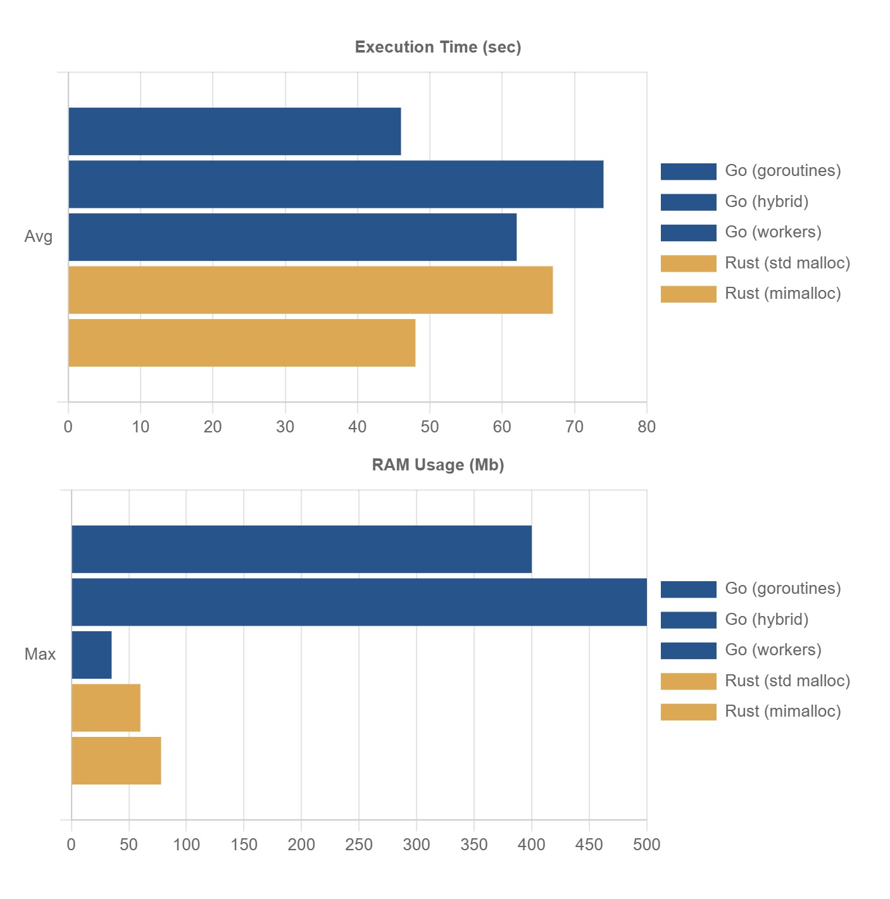
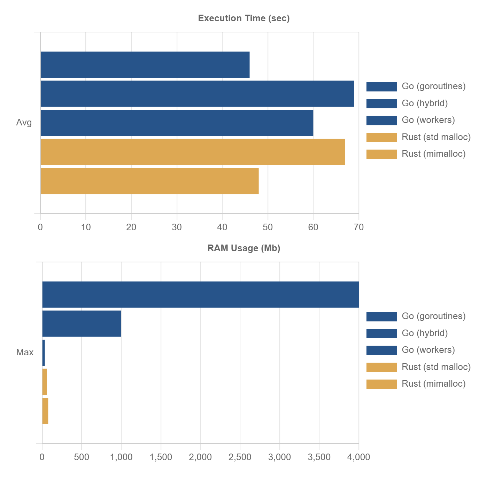

# Test description

In the test we run 100'000 tasks, in each task 10'000 small structs created, inserted into and retrieved from a hash-map by their keys.

Note that this is CPU only operation. No blocking I/O calls. I'm evaluating Go and Rust to write high-performance multiplayer server. In the main game-loop the server will not perform any I/O calls. All requests will be processed using game data in the RAM.

## First run

**NOTE:** The tests were executed on Windows/Intel CPU. A few people reported different results on MacOS with Apple M CPU, where Rust performed better.

Rust was 30% slower with the default malloc. While the biggest difference was massive RAM usage by Go: 2-4Gb vs Rust's only 35-60Mb. But why? Is that simply because GC could't keep up with so many goroutines allocating memory?

I've notice that on average Rust finished a task in 0.006s (max in 0.053s), while Go's average task duration was 16s! A massive differrence! If both finished all tasks at roughtly the same time that could only mean that Go was executing thousands of tasks in parallel sharing limited amount of CPU threads. Rust was most likely running only couple of them at once. This explains why Rust's average task duration was so short and RAM usage so small.

## Rust optimizations

I've received a suggestion to use mimalloc instead of default memory allocator. With mimalloc Rust gave much better results, which were approximately the same as Go on my Windows machine. But again, note that on MacOS Rust performed even better.

## Go optimizations

**1: goroutines with CPU workers**

Since Go runs so many tasks in paralell it keeps thousands of hash maps filled with thousands of structs in the RAM. GC can't even free this memory because it is still is use. Rust on the other hand only creates couple of hash maps at once.

To solve this problem I've created a simple utility called "CPU workers". It will run a task/function in a goroutine, but it will not create more goroutines than CPU threads available.

Note that I'm still starting 100'000 goroutines - one per task. But instead of running the task inside each goroutine directly I call CPU worker from goroutine to execute my task function. That means I'm running 100'000 + 12 (CPU workers) gouroutines in total. This makes most goroutines to wait while limited number of CPU workers execute tasks and therefore they won't allocate thousands of hash maps at once.

With this optimization Go's memory usage dropped to 1000Mb at the beginning of the test and went down to 200Mb as test aproached the end. Which makes sence: more goroutines finished - more memory is released. This is at least 4 times better than before, but still far away from Rust.

**2: CPU workers only**

With the optimization #1 we are still creating 100'000 goroutines, most of which will wait 12 CPU workers (my CPU has 12 threads).

Let's use only CPU workers so we'll never create more goroutines than nessessary. 

With this change RAM usage dropped to 35Mb while execution time increased from 46s to 60s. I think this is a very reasonable price to pay. Note that we are still doing the same work: creating 100'000 goroutines, but not all at once.

**3: More CPU Workers**

I've also played with number of CPU Workers running in parallel. Limiting them to number of CPU threads (12 in my case) sounded reasonable. But running 60 workers gave solid 25% improvement. This change also increased RAM usage a bit - now it is similar to Rust with mimalloc: ~80Mb.

**4: Pool of CPU workers**

Instead of creating new gorotine every time, we can create a pool of goroutines and reuse them for multiple tasks. This can potentially remove overhead of creating and destroying 100'000 goroutines. While in reality this only gave a small performance gain. So goroutines are indeed low-overhead primitives.

## Instant burst vs continuous flow of requests

I've also realized that creating all 100'000 tasks at once in the beggining of the test is not what would happen in a multiplayer game server.

So I've simulated steady stream of request by creating 10 tasks each millisec (10'000 requests per sec). This decreased Go's RAM usage from 4Gb to 400-500Mb. If we create 10 tasks each 3 millisec (~3000 requests per sec), RAM usage drops to 120Mb even without any optimization above.

## Final thoughts

The test results showed that Go's goroutines need an extra care when CPU load approaches 100% utilization. Whereas Rust's tokio handles it gracefully out of the box. Still, the optimization required for Go was very simple. Many of them were experiments that I don't use in the final version, so I wouldn't call it a problem.

## How to run the test

**Go:**

Edit main.go to enable/disable different test types.

```
cd go
go run -ldflags="-s -w" .
```

**Rust:**

```
cd rust
cargo run --release
```

# Test Results

Platform: Windows 10 Pro, Intel(R) Core(TM) i7-9850H CPU @2.60GHz

## Start 10 new tasks each millisec

This test simulates steady flow of requets until all 100'000 tasks started, which takes about 10 seconds in the beginning of the test. Then we wait all of them to finish.

**Go (goroutines):**
 - Goroutines only: finished in 46.8229s, task avg 0.1611s, min 0.0000s, max 3.0188s, RAM: up to 400Mb
 - Goroutines + CPU workers: finished in 74.9265s, task avg 0.0090s, min 0.0000s, max 0.0906s, RAM: up to 500Mb
 - CPU workers only: finished in 62.1834s, task avg 0.0074s, min 0.0005s, max 0.1315s, RAM: up to 35Mb

**Rust (tokio tasks):**
 - With std malloc: finished in 66.4028708s, task avg 6ms, min 4ms, max 43ms, RAM: up to 57Mb
 - With mimalloc: finished in 47.7435647s, task avg 4ms, min 3ms, max 39ms, RAM: up to 77Mb

 

## Instant burst

This test starts all 100'000 tasks as quick as possible. Then waits all of them to finish.

**Go (goroutines):**
 - Goroutines only: finished in 46.61s, task avg 16.77s, min 0.00s, max 46.31s, RAM: 2000Mb - 4000Mb
 - Goroutines + CPU workers: finished in 69.23s, task avg 0.0079s, min 0.0000s, max 0.0972s, RAM 200-1000Mb (1000Mb at start, tend to go down to 200Mb when running)
 - CPU workers only: finished in 60.7386s, task avg 0.0072s, min 0.0022s, max 0.0399s, RAM: up to 35Mb

**Rust (tokio tasks):**
 - With std memalloc: finished in 67.67s, task avg 6ms, min 3ms, max 53ms, RAM: 35Mb - 60Mb
 - With mimalloc: finished in 48.65s, task avg 4ms, min 3ms, max 59ms, RAM: 78Mb



