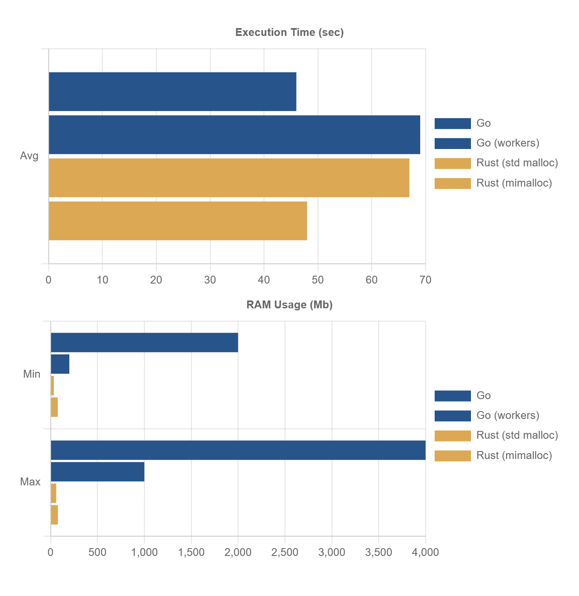

# Test Description

We run 100'000 parallel tasks, in each task 10'000 small structs created, inserted into a hash-map, and after that retrieved from the hash-map by the key.

**Go:**

```
cd go
go run -ldflags="-s -w" .
```

**Rust:**

```
cd rust
cargo run --release
```

# Test Results

**Go (goroutines):**
 - finished in 46.32s, one task avg 23.59s, min 0.02s, max 46.32s
 - RAM: 1.5Gb - 4Gb

**Rust (tokio tasks):**
 - finished in 67.85s, one task avg 33.237s, min 0.007s, max 67.854s
 - RAM: 35Mb - 60Mb


